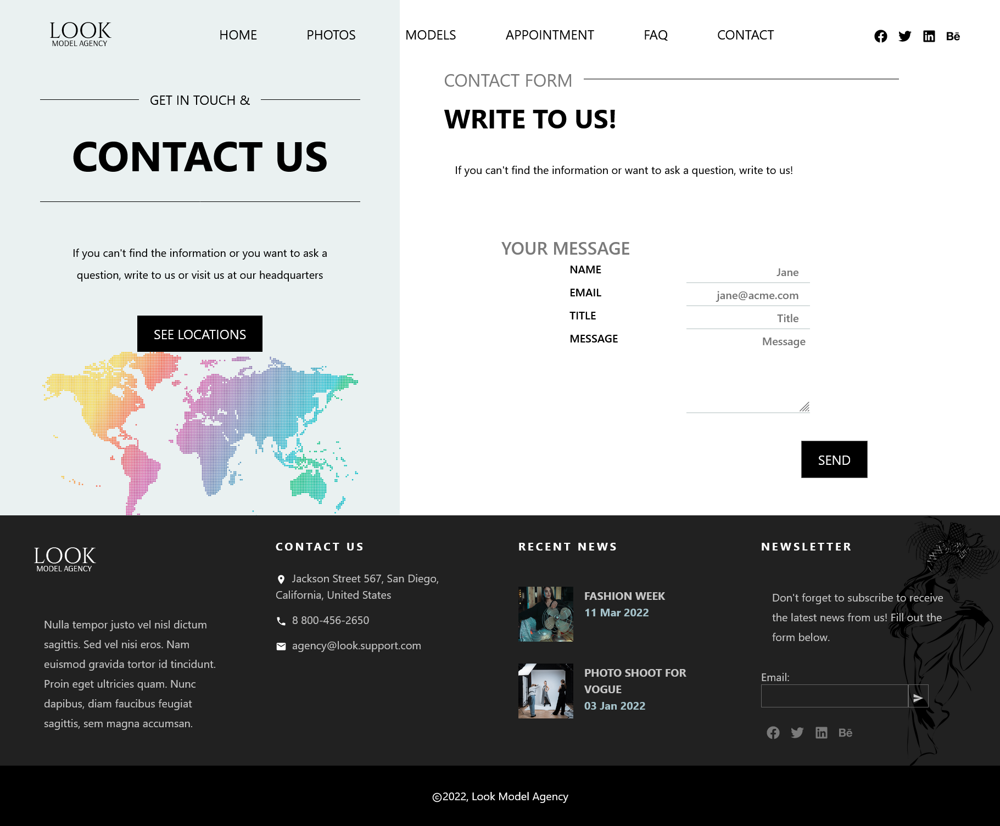

# Look Agency - a modern website for a model agency

Responsive and animated page of a model agency. It contains photo gallery, about models paage, an application form with validation, a location map.

The inspiration to create the website was a template from themeforest.net, which I found while browsing Pinterest.

## ✨ Overview

### 📷 Screenshots

### 🎯 Features

- Form validation in yup
- Form data stored in local storage
- Animations

### 💎 Pages

- Home page
- Gallery page
- Models page
- Model page
- Appointment page
- Contact page
- Location page
- 404 page

### 🔎 Links

Visit the website at https://look-model-agency.netlify.app

### 🚀 Tech stack

- React 18
- Styled Components
- Framer Motion
- Leaflet
- Formik
- Yup

## 🏃‍♀️ Run locally

### Clone the project

`git clone https://github.com/dboinska/look-model-agency`

### Go to the project directory

`cd look-model-agency`

### Install dependencies

`npm install`

### Start the server

`npm start`
